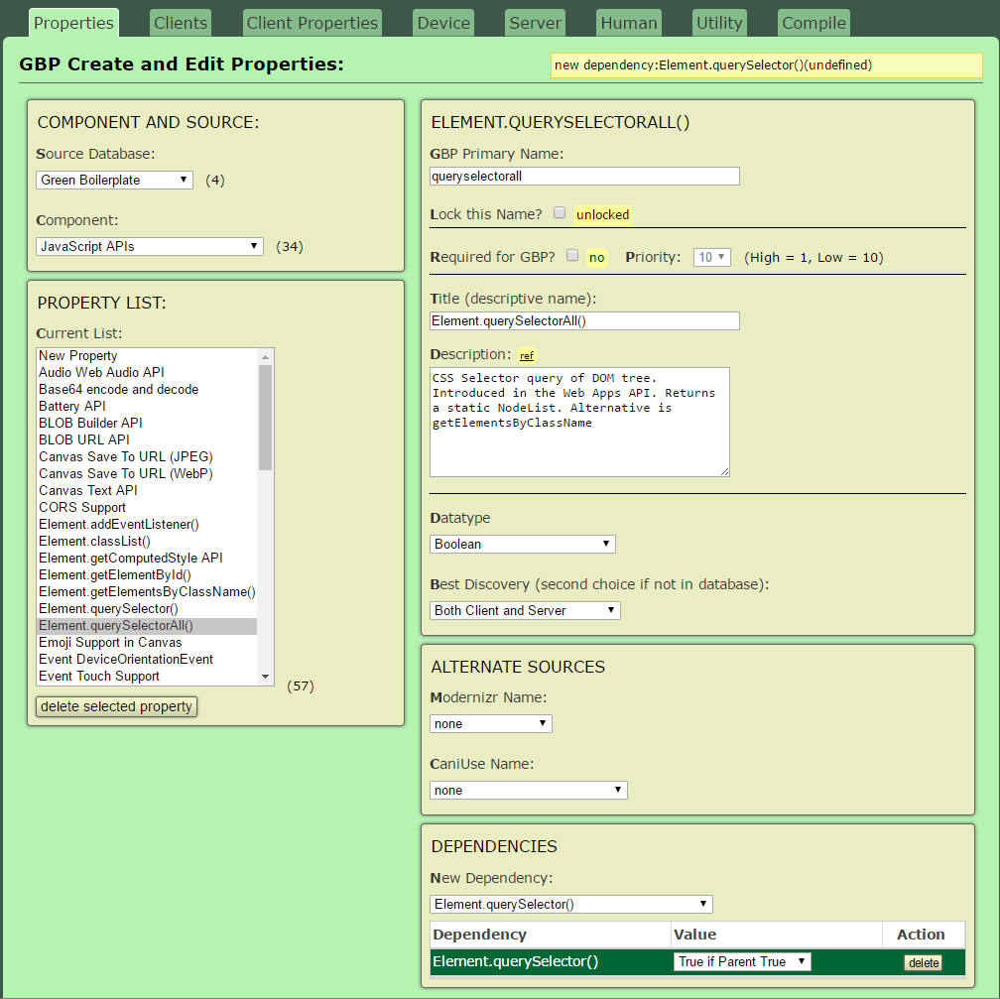
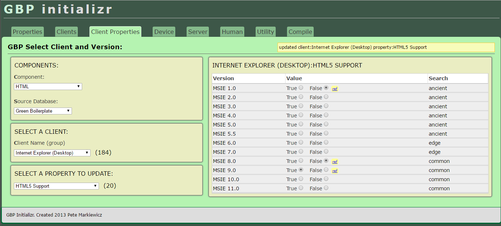
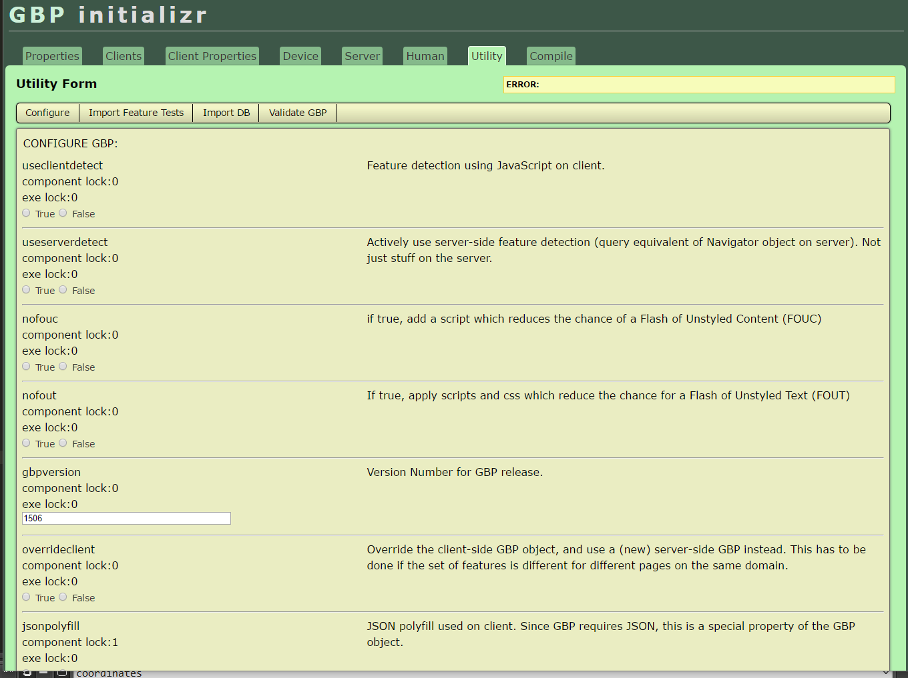
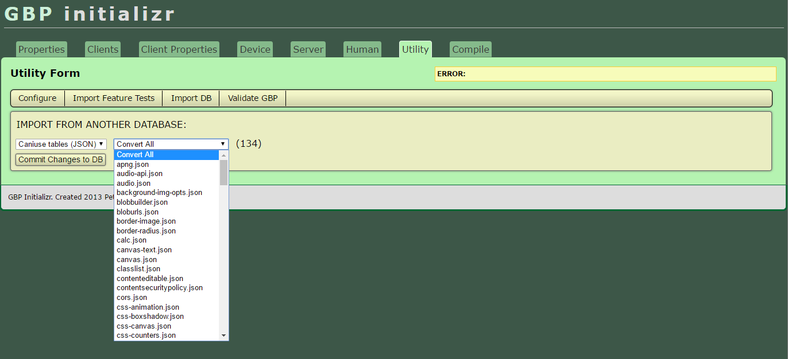
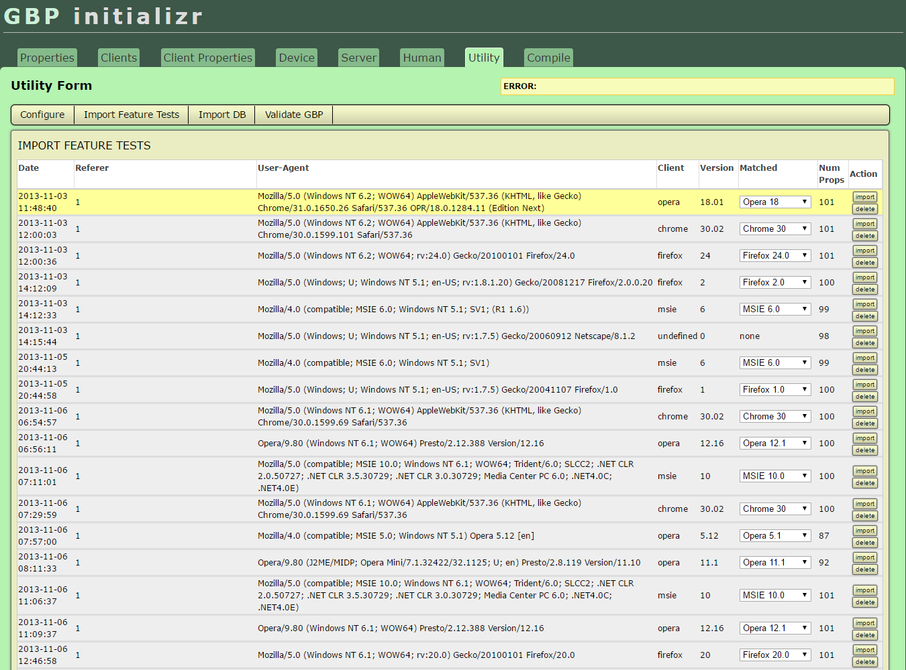

## 

...A database application generating efficient feature detection scripts with maximal inclusive design patterns.

The goals:

1. Create a comprehensive database of web browsers, both modern and ancient.

2. Map supported HTML, CSS, JS API feature support to browsers in the database.

3. Use user-agents in old, obsolete browsers to tie feature data to browsers, avoiding the need for active feature detection on the client-side

4. Generate JSON output which can be used by [Green Boilerplate](http://github.com/pindiespace/green-boilerplate) to create a custom feature detector for each browser visit to the website. For new browsers, the feature detection script consists mostly of JavaScript detector functions. For obsolete browsers, the script consists mostly of hard-coded feature lists.

## Description

Green Boilerplate Initializr is part of a larger project I worked on 2011-2013 as part of a web sustainability initiative (([see the blog at](http://sustainablevirtualdesign.wordpress.com) ). Two projects in this archive, Green Boilerplate (GBP) and Green Boilerplate Initializr form a pair of web apps for creating more sustainable websites.

The role of GBP in the system is to run code on the client and server which results in minimal downloads and efficient scripts for old browsers. This helps to satisfy Web Sustainability principles of Inclusive Design and Progressive Enhancement - we try to support edge cases as well as possible. GBP uses the database created by Initializr, encoded as JSON output and automatically added to the web page at the server level.

Initializr contains the data for new and older browsers concerning their support for HTML, CSS, and JavaScript API features. It also contains similar lists for common web servers, networks, and even producer workflows. To date, only the browser feature lists have been implemented.

## Usage

The first step in using GBP Initializr is to create a list of supported feature detects, or browser and server properties.

In the example, the JavaScript API Element.querySelectorAll() has been selected. It includes a short description, links to relevant websites, and equivalent names for properties in Modernizr and Caniuse databases. Finally, properties can be made dependent - the presence of Element.querySelectorAll() depends on Element.querySelector() support. This allows property inference for browsers that haven't been tested yet for a property.

The second screen allows definition of new web browsers and versions for those browsers in the database. Like the Properties dialog, it allows storing comments and references. It also saves the release data for the version (which allows inference of obsolesence) and grouping into broad categories (ancient, mobile, common...).

The third dialog shown allows manual entry of features for web browsers. It is 'sparse', meaning that a new feature is automatically assumed not to have existed in earlier web browsers. The example shows HTML5 support for Internet Explorer. The original browser's support is marked as 'false', with the value flipping to 'true' in IE9.

The fourth dialog shows the configuration options for the program, including the ability to import feature tests either from existing libraries like [caniuse](http://caniuse.com), or from local browser detects. The browser detects are generated from a full developer version of the Green Boilerplate JS (with all feature tests enabled) and stored in a MySQL database each time a browser accesses the developer website.

This dialog shows the interface for importing feature tests from other libraries.

This dialog shows the interface for importing feature tests from the developer website. Each time the site is loaded, the feature tests are stored in a MySQL database. Individual tests can be selected for import and merging with the local database, based on the user-agent.

## Conclusions

After GBP was developed, changes in the web development process, as well as browser tech made the system less necessary. Microsoft switched from IE to Edge, a standards-compliant browser, and all the browser manufacturers went 'evergreen' - meaning that there were fewer obsolete browsers on user computers, and there is less need to load polyfill libraries for most visitors to a website. In addition, the server-side compile that GBP uses has been replaced by NodeJS-based tools.

