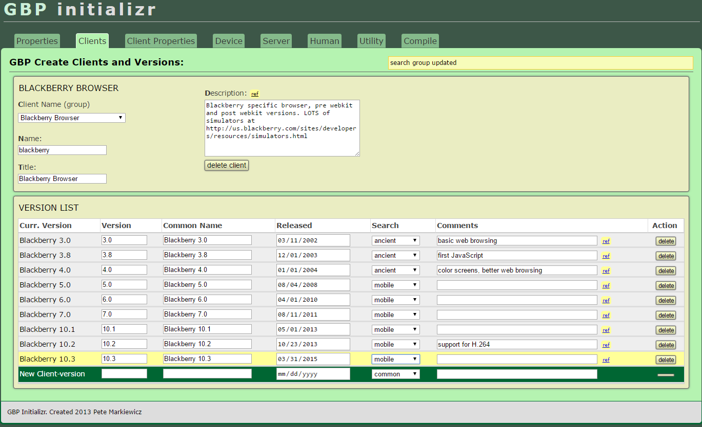

## 

...A database application generating efficient feature detection scripts with maximal inclusive design patterns.

## The Problem

**[Green Boilerplate](http://github.com/pindiepsace/green-boilerplate-initializr)** was a project I worked on from 2011 to 2014 alongside with developing a theory of Sustainable web design. 

This project required generating a comprehensive list of web browsers, their features (HTML, CSS< and JavaScript APIs) and methods for detecting those features (JavaScript functions).

## The Solution

This PHP/MySQL web app implements a feature database, along with a 'compiler' generating rapid-lookup code and data arrays. The 'compiled' JS object has a very small footprint and can be injected into a web page directly, reducing its overall carbon footprint.

## Features

1. A comprehensive database of web browsers, both modern and ancient, with their features indexed by version and release data.

2. For each feature, a corresponding JavaScript function which can detect the feature in the browser. The database stores the function, along with the results of prior feature detects using the function.

3. A method to enter new feature data, keyed to one or more user-agents generated by the browser.

4. A resolver which merges feature results. For example, if IE9 was the first browser to support HTML5, older browsers are automatically listed as not having support, and newer ones (e.g. IE11) as having support.

4. Generate fast lookup array files which can be used which can be used by the [Green Boilerplate](http://github.com/pindiespace/green-boilerplate) PHP script to create a custom feature detector for each browser visit to the website. By compiling out the features, and indexing them to user agents, it is practical to download a uniquely customized feature detector script to each browser visiting the website.

 - For new browsers, the feature detection script consists mostly of JavaScript detector functions. 

 - For obsolete browsers, the script consists mostly of hard-coded feature lists.

## Challenges

Green Boilerplate Initializr is part of a larger project I worked on 2011-2013 as part of a web sustainability initiative (([see the blog at](http://sustainablevirtualdesign.wordpress.com) ). Two projects in this archive, Green Boilerplate (GBP) and Green Boilerplate Initializr form a pair of web apps for creating more sustainable websites.

To work well, the database had to allow new features to be added, and 'merge' new feature data into the existing database. This allowed information for older browsers to be filled in without exhaustively testing each feature. This was solved by including the release date for each browser version, as well as incept dates for various HTML, CSS, and JS features. When building a script, the database could interpolate in the following way:

 - If an old browser's release date was before the implementation of a feature, it was assumed not to support the feature

 - New browsers were assumed to support all old browser features, except in cases where a feature had been deprecated. Adding 'deprecated' features was handled by making them a feature in themselves.

## Usage

The first step in using GBP Initializr is to create a list of supported feature detects, or browser and server properties.

In the example, the JavaScript API Element.querySelectorAll() has been selected. It includes a short description, links to relevant websites, and equivalent names for properties in Modernizr and Caniuse databases. Finally, properties can be made dependent - the presence of Element.querySelectorAll() depends on Element.querySelector() support. This allows property inference for browsers that haven't been tested yet for a property.

The second screen allows definition of new web browsers and versions for those browsers in the database. Like the Properties dialog, it allows storing comments and references. It also saves the release data for the version (which allows inference of obsolesence) and grouping into broad categories (ancient, mobile, common...).

The third dialog shown allows manual entry of features for web browsers. It is 'sparse', meaning that a new feature is automatically assumed not to have existed in earlier web browsers. The example shows HTML5 support for Internet Explorer. The original browser's support is marked as 'false', with the value flipping to 'true' in IE9.

The fourth dialog shows the configuration options for the program, including the ability to import feature tests either from existing libraries like [caniuse](http://caniuse.com), or from local browser detects. The browser detects are generated from a full developer version of the Green Boilerplate JS (with all feature tests enabled) and stored in a MySQL database each time a browser accesses the developer website.

This dialog shows the interface for importing feature tests from other libraries.

This dialog shows the interface for importing feature tests from the developer website. Each time the site is loaded, the feature tests are stored in a MySQL database. Individual tests can be selected for import and merging with the local database, based on the user-agent.

## Conclusions

 The biggest problem with the system was the compile step. The steps needed to query the database to generate a complete list of features for all browsers and their versions packed in an efficient 'array on the disk' format allowed by PHP turned out to take lots of CPU power. As the database grew, computing time went up nearly exponentially. The current database takes many minutes to generate the 'array on the disk' files used by the [Green Boilerplate](http://github.com/pindiespace/green-boilerplate) object.

After GBP was developed, changes in the web development process, as well as browser tech made the system less necessary. Microsoft switched from IE to Edge, a standards-compliant browser, and all the browser manufacturers went 'evergreen' - meaning that there were fewer obsolete browsers on user computers, and there is less need to load polyfill libraries for most visitors to a website. In addition, the server-side PHP/MySQL system compile that GBP uses has been replaced by NodeJS-based tools.

